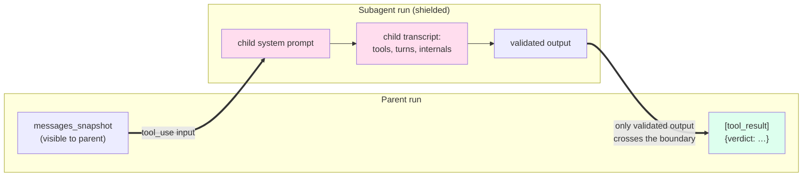

# Vistierie


> **A Java agent framework that lets any application become agentic, with cost-discipline and operational controls baked into the core, not bolted on.**

Vistierie runs LLM-driven worker agents on behalf of consumer applications.
You hand it a tool schema, a system prompt, and (optionally) a cron
expression; Vistierie owns the rest: parallel HTTP tool dispatch,
recursive subagents with context shielding, scheduled execution, a
per-call audit trail with token-accurate EUR-micros cost, a kill switch
per tenant, and tier-based model routing.

[](https://github.com/visterion/vistierie/actions/workflows/docker.yml)
[](https://github.com/visterion/vistierie/actions/workflows/test.yml)
[](https://github.com/visterion/vistierie/actions/workflows/codeql.yml)
[](https://codecov.io/gh/visterion/vistierie)
[](https://github.com/visterion/vistierie)
[](LICENSE)
[](https://openjdk.org)
[](https://spring.io/projects/spring-boot)
[](https://postgresql.org)

**Docker image:** [`ghcr.io/visterion/vistierie:main`](https://github.com/visterion/vistierie/pkgs/container/vistierie)

---

## What Vistierie is for

Modern applications increasingly need to do things autonomously: curate
data overnight, react to events, run periodic checks, dispatch worker
LLMs against scoped tasks. Building that yourself means stitching
together an SDK, a scheduler bean, a tool-dispatch loop, an audit
table, a cost rollup, and a way to switch it all off when something
goes wrong.

Vistierie is the service that owns that stitching. Your application
keeps its prompts, tools, and domain logic; Vistierie keeps the runtime.

**What sets it apart from LangChain4j and Spring AI:** cost-discipline
and operational controls are first-class concepts, not add-ons.

- **Tier-based routing**: declare an agent's purpose (`reasoning`,
  `routine`, `bulk`); the resolver picks the concrete model. Switching
  Opus → Haiku is a config change, not a code change.
- **Tenant kill switch**: one POST freezes all autonomous activity
  for a tenant. Checked before every dispatch and every cron tick.
- **Per-call audit**: every LLM call writes a row to
  `vistierie.llm_calls` with input/output/cache tokens and EUR-micros
  cost. Failed calls land there too, they're the most important to
  observe.
- **Privacy-locked routing**: rules can pin a sensitive realm (e.g.
  `medical`) to a specific provider regardless of any model override
  in the request body.
- **Cost-optimized fallback routing**: routing rules carry an optional
  one-step fallback provider+model, including Claude-subscription support
  via the `claude-bridge` sidecar, so a failed or quota-limited primary
  call degrades gracefully instead of failing the request.

---

## Two consumers, two perspectives

Vistierie sees only opaque `tenant`, `realm`, `purpose`, `messages`,
`payload`. The semantics live with the consumer.

### From HiveMem's perspective

HiveMem is a knowledge base. Its data hygiene drifts: cells get added
but the **knowledge graph** doesn't always learn the new facts, and
related cells often sit orphaned without **tunnels** linking them.
HiveMem registers a **Queen** that runs hourly and two specialized
**Bees**: one extracts missing KG facts, one builds missing tunnels.
The Queen scans a realm, picks the worst-organized one, and
dispatches both Bees in parallel for that realm.

```bash
# 1: Bee that extracts knowledge-graph facts from a cell batch
curl -X POST http://vistierie:8090/agents \
  -H "Authorization: Bearer $HIVEMEM_TOKEN" -d '{
    "name": "bee-kg-extractor",
    "system_prompt": "Extract subject-predicate-object facts from the given cells. Reuse existing KG entities where possible.",
    "model_purpose": "routine",
    "tools": [
      {"name":"cell.read","webhook_url":"http://hivemem:8080/tools/cell.read",
       "input_schema":{"type":"object"}},
      {"name":"kg.add","webhook_url":"http://hivemem:8080/tools/kg.add",
       "input_schema":{"type":"object"}}
    ],
    "output_schema": {"type":"object","required":["facts_added","cells_scanned"],
      "properties":{"facts_added":{"type":"integer"},"cells_scanned":{"type":"integer"}}},
    "webhook_token": "<hivemem-side-secret>"
  }'

# 2: Bee that builds tunnels between related cells in a realm
curl -X POST http://vistierie:8090/agents \
  -H "Authorization: Bearer $HIVEMEM_TOKEN" -d '{
    "name": "bee-tunnel-builder",
    "system_prompt": "Find cells that should be linked by tunnels. Score similarity, link top matches.",
    "model_purpose": "routine",
    "tools": [
      {"name":"cell.search","webhook_url":"http://hivemem:8080/tools/cell.search",
       "input_schema":{"type":"object"}},
      {"name":"tunnel.add","webhook_url":"http://hivemem:8080/tools/tunnel.add",
       "input_schema":{"type":"object"}}
    ],
    "output_schema": {"type":"object","required":["tunnels_added"],
      "properties":{"tunnels_added":{"type":"integer"}}},
    "webhook_token": "<hivemem-side-secret>"
  }'

# 3: Queen on hourly schedule; both Bees wired in as subagent tools
curl -X POST http://vistierie:8090/agents \
  -H "Authorization: Bearer $HIVEMEM_TOKEN" -d '{
    "name": "queen-curation",
    "system_prompt": "Each hour, audit one realm. If KG facts are sparse, dispatch bee-kg-extractor. If tunnels are missing, dispatch bee-tunnel-builder. You may run both in parallel.",
    "model_purpose": "reasoning",
    "schedule": "0 0 * * * *",
    "tools": [
      {"name":"realm.health","webhook_url":"http://hivemem:8080/tools/realm.health",
       "input_schema":{"type":"object"}},
      {"name":"extract_kg_facts","type":"subagent","target_agent":"bee-kg-extractor",
       "input_schema":{"type":"object","required":["realm","cell_ids"]}},
      {"name":"build_tunnels","type":"subagent","target_agent":"bee-tunnel-builder",
       "input_schema":{"type":"object","required":["realm"]}}
    ],
    "output_schema": {"type":"object","required":["realm","actions"],
      "properties":{"realm":{"type":"string"},"actions":{"type":"array"}}},
    "webhook_token": "<hivemem-side-secret>"
  }'
```

Every hour Vistierie fires the Queen. The Queen calls
`realm.health` to find the realm in worst shape, then emits both
subagent tool-uses in the same turn, Vistierie dispatches the two
Bees on virtual threads in parallel. Each Bee runs its own loop with
its own tools (`cell.read`/`kg.add` vs `cell.search`/`tunnel.add`)
and returns a validated JSON object: `{facts_added: 47,
cells_scanned: 120}` and `{tunnels_added: 9}`. Those two
`tool_result` blocks, and nothing else from the Bee transcripts,
land in the Queen's context (see [Context shielding](#context-shielding)
below). The Queen aggregates them into its `actions` array, hits
`end_turn`, and HiveMem receives the verdict via completion webhook.

### From Dracul's perspective

Dracul runs nightly and needs to dispatch **Strigoi** agents that
hunt for findings across its data. Different Strigoi types want
different model tiers, `Strigoi-Spin` reasons hard and gets Sonnet,
`Strigoi-Echo` is a cheap classifier and gets Haiku.

```bash
# Dracul registers a Strigoi, purpose drives tier-based routing
curl -X POST http://vistierie:8090/agents \
  -H "Authorization: Bearer $DRACUL_TOKEN" -d '{
    "name": "strigoi-spin",
    "system_prompt": "You investigate anomalies and report findings.",
    "model_purpose": "reasoning",
    "schedule": "0 0 3 * * *",
    "tools": [
      {"name":"prey.scan","webhook_url":"http://dracul:8081/tools/prey.scan",
       "input_schema":{"type":"object"}}
    ],
    "output_schema": {"type":"object","required":["findings"],
      "properties":{"findings":{"type":"array"}}},
    "webhook_token": "<dracul-side-secret>"
  }'
```

At 03:00 every night, Vistierie wakes the Strigoi, routes it to the
provider+model that the operator wired up for `dracul/reasoning`, and
delivers the validated `findings` array back to Dracul via webhook.
If the operator flips the kill switch on the `dracul` tenant, no
Strigoi fires the next night until the switch is released.

---

## Context shielding

The single non-trivial idea in Vistierie. When a parent agent
dispatches a subagent, the parent never sees the child's system
prompt, intermediate turns, or tool calls. Only the **validated JSON
output** crosses the boundary, packaged as a `tool_result` block.



**Why it matters.** A Queen orchestrating five Bees doesn't pay for
five full Bee transcripts in its own context window. A Bee operating
on `medical` cells doesn't leak raw cell content into a Queen running
with broader scope. Every subagent-eligible agent declares an
`output_schema`; validation happens before the boundary crosses, so
the parent always receives well-typed JSON.

---

## How runs start

Every run shares one execution path; only the trigger differs.

- **Manual**: `POST /agents/{name}/run` returns 202 with a `run_id`.
  Long-poll with `GET /runs/{id}?wait_seconds=30` for the result.
- **Subagent**: a parent agent emits `tool_use` with `type=subagent`.
  Recursion is bounded (default depth 5).
- **Cron**: agents with a `schedule` field fire on the next boundary.
  A 30-second tick is kill-switch-aware and skips if the previous run
  is still open. Idempotency is the consumer's job.
- **Streaming**: an agent with `session_duration_seconds` set becomes a
  **Streaming Bee**. On its `schedule` boundary it opens a time-boxed
  session, polls a consumer-hosted `event_source_url` every
  `poll_interval_seconds`, and spawns one child run
  (`trigger=session_event`) per returned event until the window closes.
  Idle polling makes no LLM calls; inspect sessions with
  `GET /agents/{name}/sessions`.

For tasks that tolerate < 1 h latency, `POST /agents/{name}/batch`
routes through Anthropic's Message Batches API at 50 % cost (up to
10 000 items per batch). Batch mode requires the Anthropic provider;
Bedrock and other providers are not supported for batch runs.

---

## Inspect & search runs

Every completed run is captured as a provider-neutral transcript —
`GET /runs/{id}/transcript?view=digest|compact|full` — with per-tool-call
drill-down via `GET /runs/{id}/tool-calls/{toolUseId}`, and indexed into a
Postgres full-text document. Search a tenant's runs with
`GET /runs/search?q=...` (filters: `agent`, `status`, `has_error`, `from`,
`to`); operators search any tenant via `GET /admin/runs/search?tenant=...`.

---

## Synchronous LLM gateway

Not everything needs an agent. For a one-shot request/response call,
hit the gateway directly, the same tier routing, per-call audit, EUR-micros
cost accounting, and tenant kill switch all still apply:

- `POST /llm/complete` — text completion against the tenant's routed model.
- `POST /llm/vision` — single-image understanding (one `image` + a `prompt`).
- `POST /llm/vision-multi` — N images plus one prompt forwarded as a single
  model call (N native image blocks + one text block).

Each response carries the same `text`, `stop_reason`, `usage`,
`cost_micros`, and `llm_call_id` fields and writes a `vistierie.llm_calls`
row, just like an agent run. Vision requests route through whichever
provider the operator wired up for the call's `<tenant, realm, purpose>`.

---

## Quick start

```bash
docker run --rm -p 8090:8090 \
  -e VISTIERIE_DB_URL=jdbc:postgresql://host.docker.internal:5432/vistierie \
  -e VISTIERIE_DB_USER=vistierie \
  -e VISTIERIE_DB_PASSWORD=vistierie \
  -e VISTIERIE_ADMIN_TOKEN_HASH='<bcrypt-hash>' \
  -e ANTHROPIC_API_KEY='sk-ant-...' \
  -e OPENAI_API_KEY='sk-...' \
  -e XAI_API_KEY='xai-...' \
  ghcr.io/visterion/vistierie:main
```

Generate `VISTIERIE_ADMIN_TOKEN_HASH` first — see
[generating the admin token hash](documentation/operations.md#generating-the-admin-token-hash).
On Linux, `host.docker.internal` is not resolved by default; add
`--add-host=host.docker.internal:host-gateway` to the `docker run` line (or
point `VISTIERIE_DB_URL` at the Postgres host directly).

To use **AWS Bedrock** instead of (or alongside) direct provider APIs:

```bash
docker run --rm -p 8090:8090 \
  -e VISTIERIE_DB_URL=jdbc:postgresql://host.docker.internal:5432/vistierie \
  -e VISTIERIE_DB_USER=vistierie \
  -e VISTIERIE_DB_PASSWORD=vistierie \
  -e VISTIERIE_ADMIN_TOKEN_HASH='<bcrypt-hash>' \
  -e BEDROCK_ENABLED=true \
  -e AWS_REGION=eu-north-1 \
  -e AWS_BEARER_TOKEN_BEDROCK='ABSK...' \
  ghcr.io/visterion/vistierie:main
```

After startup, point a routing rule at `"provider": "bedrock"` with an inference
profile ID such as `eu.anthropic.claude-sonnet-4-6`. The SDK reads
`AWS_BEARER_TOKEN_BEDROCK` natively for ABSK API key authentication.

Long Bedrock calls that exceed the default 180s socket read timeout can be tuned
via `vistierie.bedrock.read-timeout-seconds` (see configuration.md).

For local development:

```bash
cd java-server && docker compose -f docker-compose.dev.yml up --build
```

Seeding tenants, generating the admin bcrypt hash, and cost-rollup
queries: [`documentation/operations.md`](documentation/operations.md).

---

## Documentation

| | |
|---|---|
| [agents.md](documentation/agents.md) | Agent definition, tool format, subagent context shielding, scheduling |
| [api.md](documentation/api.md) | REST endpoint reference (`/llm/*`, `/agents/*`, `/runs/*`, `/admin/*`) |
| [architecture.md](documentation/architecture.md) | System overview, data model, request flow |
| [routing.md](documentation/routing.md) | `<tenant, realm, purpose>` → `<provider, model>` resolution |
| [providers.md](documentation/providers.md) | Anthropic, Bedrock, OpenAI, xAI plugins, mock mode, adding providers |
| [configuration.md](documentation/configuration.md) | All `vistierie.*` properties and env vars |
| [operations.md](documentation/operations.md) | Tenants, kill switch, cost queries, cron caveats, backups |

---

## Build from source

Requires JDK 25 and Docker (for the Postgres testcontainer used in tests).

```bash
export JAVA_HOME=/path/to/jdk-25
cd java-server
./mvnw test                        # full suite
./mvnw -Pstress test               # opt-in concurrency stress
./mvnw -DskipTests package
java -jar target/vistierie-1.2.0.jar
```

---

## Project values

- **The two-consumer rule.** A feature belongs in Vistierie only if
  both HiveMem and Dracul benefit from it. Single-consumer features
  stay in the consumer.
- **Slim consumers.** Prompts, tool implementations, and domain logic
  live in HiveMem / Dracul. Vistierie sees opaque `tenant`, `realm`,
  `purpose`, `messages`, `payload`, nothing else.
- **Audit before features.** Every LLM call writes a row regardless
  of whether the call succeeded, failed calls are the most
  important to observe.
- **Not an MCP server, not a workflow engine, not a multi-agent bus,
  not a prompt library, not a vector store.** Reasoning lives with
  the consumer; Vistierie owns the runtime.

---

## License

Apache License 2.0, see [LICENSE](LICENSE) and [NOTICE](NOTICE).
