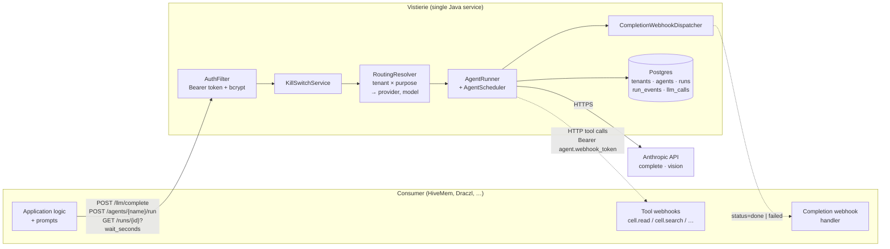
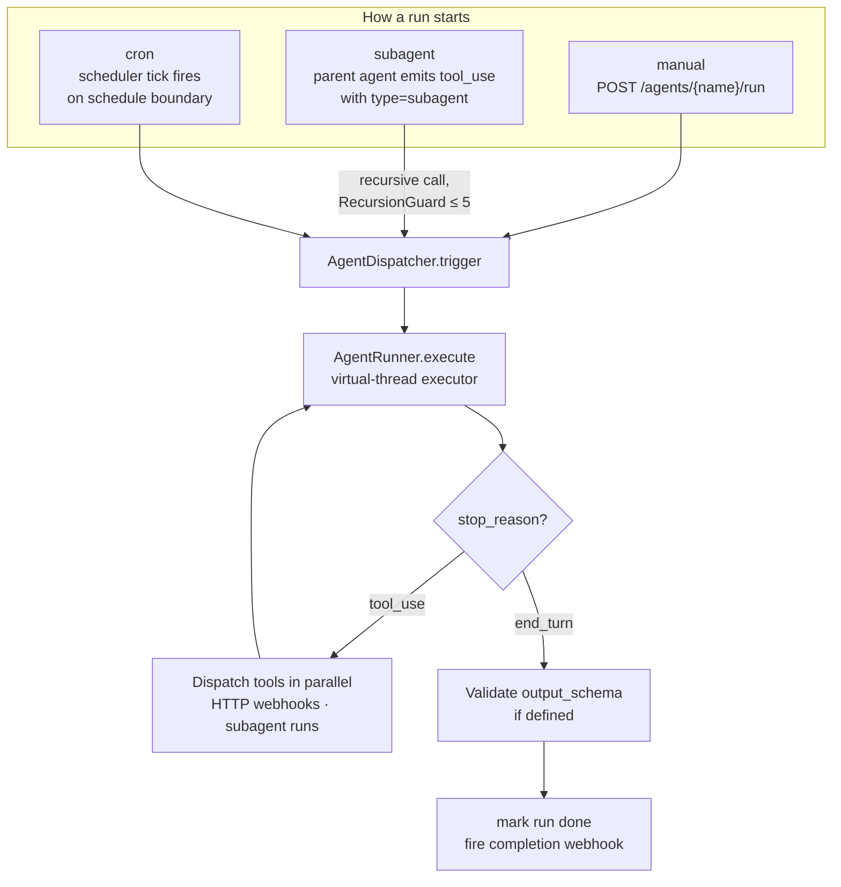
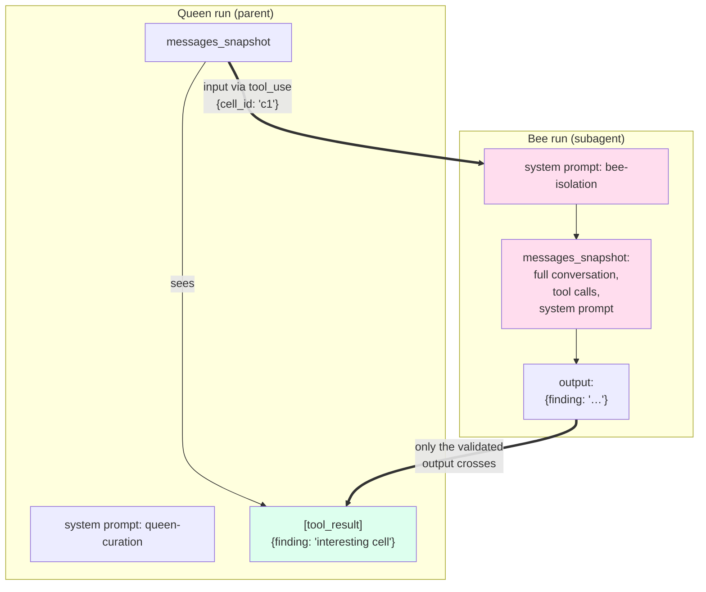
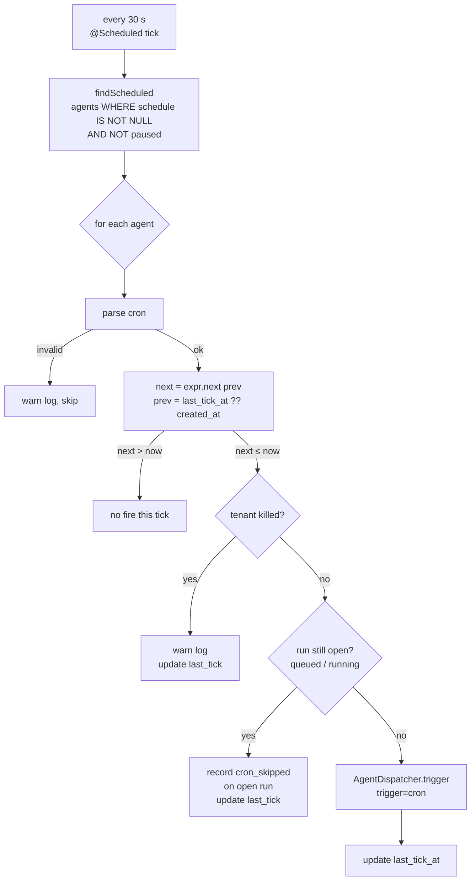

# Vistierie

> **A slim, tenant-scoped LLM gateway, agent runtime, and cron scheduler — in one service.**
>
> Consumer applications (HiveMem, Draczl, future tenants) hand Vistierie a
> `purpose`, a `messages` array, and an opaque `payload`. Vistierie
> authenticates the caller, checks the kill switch, resolves the per-tenant
> routing policy to a concrete provider and model, runs the agent loop
> (parallel HTTP tools + recursive subagents with context shielding), fires
> cron-scheduled runs, and writes a Postgres audit row with exact token
> counts and micro-EUR cost — for every single LLM call.

[](https://github.com/visterion/vistierie/actions/workflows/docker.yml)
[](LICENSE)
[](https://openjdk.org)
[](https://spring.io/projects/spring-boot)
[](https://postgresql.org)
[](https://github.com/visterion/vistierie/actions/workflows/docker.yml)

**Docker image:** [`ghcr.io/visterion/vistierie:main`](https://github.com/visterion/vistierie/pkgs/container/vistierie) for the rolling `main` branch.

---

## Why Vistierie exists

Every product that uses LLMs faces the same plumbing problem: vendor SDKs
proliferate, kill switches and cost caps live in scattered glue code,
audit trails are inconsistent across services, and any "agent that runs on
a schedule" turns into a one-off `@Scheduled` bean buried in a consumer
codebase. Multiply that across two products (HiveMem + Draczl + future
tenants) and the duplication explodes.

Vistierie is the single service that owns that plumbing.

- **One bearer-token surface.** Tenants authenticate with one bcrypt-hashed
  token. Killing a tenant is one `PATCH` away.
- **One audit trail.** Every LLM call lands in `vistierie.llm_calls` with
  exact tokens, EUR-micros cost, and a `run_id` linking back to the agent
  run that triggered it. Cost rollups are a single SQL query.
- **One agent runtime.** Tenants register agents with a JSON tool schema;
  Vistierie runs the loop (parallel HTTP tools, recursive subagents with
  output-schema-validated context shielding) on virtual threads.
- **One scheduler.** A `schedule` field on an agent + a 30-second tick is
  all it takes to turn a manual workflow into a cron job — no per-consumer
  scheduler bean.

Tenants stay slim. Prompts, tool implementations, and domain knowledge live
in the consumer; Vistierie sees only opaque `tenant`, `realm`, `purpose`,
`messages`, `payload`. **The two-tenant rule:** if a feature only helps
HiveMem or only helps Draczl, it doesn't belong in Vistierie.

---

## How it works

### Big picture



Three things never leave Vistierie: provider API keys, the routing policy,
and the audit log. Three things are pure consumer concerns: prompts, tool
implementations, and domain logic. The line between them is the REST
contract.

### Three trigger paths

Every agent run is one of three kinds. They all share auth, audit, kill
switch, and the same `AgentRunner` execution path — only the entry point
differs.



`trigger="manual"`, `"subagent"`, or `"cron"` is recorded on the run row,
so an operator querying `vistierie.runs` can tell at a glance which path
produced any given run.

### Context shielding for subagents

The unique-selling-point: when a parent agent (a HiveMem **Queen**)
dispatches a subagent (a **Bee**), the parent never sees the child's
system prompt, intermediate turns, or tool calls. Only the **validated
JSON output** crosses the boundary, packaged as a `tool_result` block.



Why it matters:

- **Token budget.** A Queen orchestrating five Bees doesn't pay for five
  full Bee transcripts in its own context window.
- **Privacy by realm.** A Bee operating on `medical` cells doesn't leak
  raw cell content into a Queen running with broader scope.
- **Type contract.** Every subagent-eligible agent declares an
  `output_schema`. Validation happens before the boundary crosses, so the
  parent always receives well-typed JSON.

### Scheduler tick (Slice 3)



**Restart behaviour.** Vistierie does not replay missed cron boundaries
across a restart — `last_tick_at` is preserved but the next fire is
computed from the current clock. Treat cron as "fires roughly on
schedule"; idempotency is the consumer's job.

---

## Highlights

| | |
|---|---|
| **One service, three jobs** | LLM gateway, agent runtime, and cron scheduler — Java + Spring Boot 4, single jar, single Postgres. |
| **Slim consumers** | Prompts, tools, and domain logic stay in HiveMem / Draczl. Vistierie sees opaque `tenant`, `purpose`, `messages`, `payload`. |
| **Per-call audit** | `vistierie.llm_calls` with input / output / cache tokens and EUR-micros cost; cost rollups by run via the `run_id` join column. |
| **Tenant kill switch** | One operator API call freezes all autonomous activity for a tenant — checked before every dispatch. |
| **Parallel tool dispatch** | The agent runner fans HTTP tool calls out on virtual threads and reassembles `tool_result` blocks in arrival order. |
| **Recursive subagents** | Up to depth 5 (configurable). `RecursionGuard` is `ThreadLocal`-scoped so virtual-thread fan-out is safe. |
| **Context shielding** | Parent run records only `tool_result` summaries; child run keeps its own full transcript. JSON output schema enforced at the boundary. |
| **Cron without ceremony** | `schedule: "0 0 * * * *"` on an agent — Vistierie does the rest. Skip-if-running prevents pile-up. |
| **Batched runs at 50 % cost** | `POST /agents/{name}/batch` with up to 10 000 items routes through Anthropic's Message Batches API — half-price for tasks that tolerate < 1 h latency. Per-item output schema validation; partial-success aggregation on the parent run. |
| **In-process long-poll** | `GET /runs/{id}?wait_seconds=30` — DeferredResult-backed, no Redis. |
| **Completion webhook** | Bounded retries (0 s → 5 s → 30 s default) with `webhook_sent` / `webhook_failed` events on the run. |

---

## Slice status

| Slice | What ships | Status |
|---|---|---|
| **1 — LLM gateway** | `POST /llm/complete`, `POST /llm/vision`, Anthropic provider, kill switch, routing, audit, mock-LLM mode, GHCR image | ✅ Released |
| **2 — Agent framework** | `POST /agents` CRUD, `POST /agents/{name}/run` (202 + async), parallel HTTP tools, recursive subagents with context shielding, long-poll, completion webhook, run-level event timeline | ✅ Released |
| **3 — Scheduler** | `agents.schedule` cron field, `AgentScheduler` 30 s tick, skip-if-running, kill-switch-aware, `last_tick_at` diagnostics | ✅ Released |
| **4 — Batches** | `POST /agents/{name}/batch` (up to 10 000 items), Anthropic Message Batches API integration at 50 % cost, parent + child run topology with partial-success aggregation, `BatchPollingService` (60 s tick) with kill-switch awareness, `llm_calls.batch_id` audit link | ✅ Released |

All slices are merged to `main`. The full test suite is **105 / 105 green**
including a Postgres-backed integration suite, a real-`@Scheduled` E2E
test, a real-batch-polling E2E test, and an opt-in concurrency stress
harness (`mvn -Pstress test`).

### On the roadmap

| | |
|---|---|
| **Slice 5 — Vision attachments cache** | SeaweedFS-backed cache for vision inputs so the same `media_type+sha256` doesn't re-pay token costs across multiple agent runs. |
| **Slice 6 — Per-realm provider routing** | The `realm` field is currently audit-only. Slice 6 makes it routable so e.g. anything `realm=medical` is forced onto a local Ollama provider, per spec §8. |

---

## Quick start

```bash
docker run --rm -p 8090:8090 \
  -e VISTIERIE_DB_URL=jdbc:postgresql://host.docker.internal:5432/vistierie \
  -e VISTIERIE_DB_USER=vistierie \
  -e VISTIERIE_DB_PASSWORD=vistierie \
  -e VISTIERIE_ADMIN_TOKEN_HASH='<bcrypt-hash>' \
  -e ANTHROPIC_API_KEY='sk-ant-...' \
  ghcr.io/visterion/vistierie:main
```

For local development with everything wired up:

```bash
cd java-server
docker compose -f docker-compose.dev.yml up --build
```

Seed a tenant, generate the admin bcrypt hash, and run cost-rollup queries:
[`documentation/operations.md`](documentation/operations.md).

### A 30-second tour of the API

```bash
# 1. Admin creates a tenant — captures plaintext token (shown once)
curl -X POST http://localhost:8090/admin/tenants \
  -H "Authorization: Bearer $ADMIN_TOKEN" \
  -d '{"name":"hivemem"}' | jq .

# 2. Tenant registers an agent
curl -X POST http://localhost:8090/agents \
  -H "Authorization: Bearer $TENANT_TOKEN" \
  -H 'Content-Type: application/json' -d '{
    "name":"queen-curation",
    "system_prompt":"You curate the knowledge base.",
    "model_purpose":"queen-curation",
    "tools":[
      {"name":"cell.search","description":"semantic search","input_schema":{"type":"object"},
       "webhook_url":"http://hivemem:8080/tools/cell.search"},
      {"name":"dispatch_bee","description":"spawn a bee","input_schema":{"type":"object"},
       "type":"subagent","target_agent":"bee-isolation"}
    ],
    "output_schema":{"type":"object","properties":{"verdict":{"type":"string"}},"required":["verdict"]},
    "schedule":"0 0 * * * *",
    "webhook_token":"<consumer-side-secret>"
  }'

# 3. Trigger manually OR wait for the next cron boundary
curl -X POST http://localhost:8090/agents/queen-curation/run \
  -H "Authorization: Bearer $TENANT_TOKEN" \
  -H 'Content-Type: application/json' \
  -d '{"payload":{"focus":"medical realm"}}'
# → 202 Accepted, { "run_id": "01J…", "status": "queued" }

# 4. Long-poll for the result
curl "http://localhost:8090/runs/01J.../?wait_seconds=30" \
  -H "Authorization: Bearer $TENANT_TOKEN"
# → 200 OK with terminal status + output
```

---

## Documentation

| | |
|---|---|
| [agents.md](documentation/agents.md) | Agent definition, tool format, subagent context shielding, completion webhook, scheduling |
| [api.md](documentation/api.md) | REST endpoint reference (`/llm/*`, `/agents/*`, `/runs/*`, `/admin/tenants`) |
| [architecture.md](documentation/architecture.md) | System overview, data model, request flow |
| [routing.md](documentation/routing.md) | `<tenant, purpose>` → `<provider, model>` resolution rules |
| [providers.md](documentation/providers.md) | Anthropic plugin, mock mode, adding providers |
| [configuration.md](documentation/configuration.md) | All `vistierie.*` properties and env vars |
| [operations.md](documentation/operations.md) | Tenants, kill switch, cost queries, cron caveats, backups |

---

## Build from source

Requires JDK 25 and Docker (for the Postgres testcontainer used in tests).

```bash
export JAVA_HOME=/path/to/jdk-25
cd java-server

./mvnw test               # full suite (~30 s, 85 tests)
./mvnw -Pstress test      # opt-in concurrency stress (100 parallel runs)
./mvnw -DskipTests package
java -jar target/vistierie-0.1.0-SNAPSHOT.jar
```

Project layout mirrors HiveMem for ops consistency:

```
vistierie/
├── java-server/                Spring Boot 4 service
│   ├── src/main/java/de/vesterion/vistierie/
│   │   ├── llm/                /llm/complete, /llm/vision
│   │   ├── agents/             agent CRUD + validator
│   │   ├── agent/runner/       AgentRunner, ToolDispatcher, recursion
│   │   ├── agent/webhooks/     CompletionWebhookDispatcher
│   │   ├── runs/               run repository, controller, long-poll
│   │   ├── scheduler/          AgentScheduler + cron tick
│   │   ├── routing/            RoutingResolver + config
│   │   ├── kill/               KillSwitchService
│   │   ├── tenants/            tenant CRUD + admin endpoints
│   │   ├── audit/              LlmCallRecorder
│   │   └── auth/               AuthFilter, RequestContext
│   └── src/main/resources/db/migration/    Flyway V1, V2, V3
└── documentation/              operator + integrator docs
```

---

## Project values

- **Scope discipline.** Vistierie is *not* an MCP server, *not* a workflow
  engine, *not* a multi-agent bus, *not* a prompt library, *not* a vector
  store. Prompts live with the consumer.
- **Two-tenant rule.** Any new feature must benefit both HiveMem and
  Draczl. Single-tenant features stay in the consumer.
- **Audit before features.** Every LLM call writes a row regardless of
  whether the call succeeded — failed calls are the most important to
  observe.
- **TDD with fresh subagents.** Each implementation slice is built by
  dispatching a fresh subagent per task, with two-stage review (spec
  compliance, then code quality). Plans live under
  `docs/superpowers/plans/` (gitignored, local working notes).

---

## License

Apache License 2.0 — see [LICENSE](LICENSE) and [NOTICE](NOTICE).
