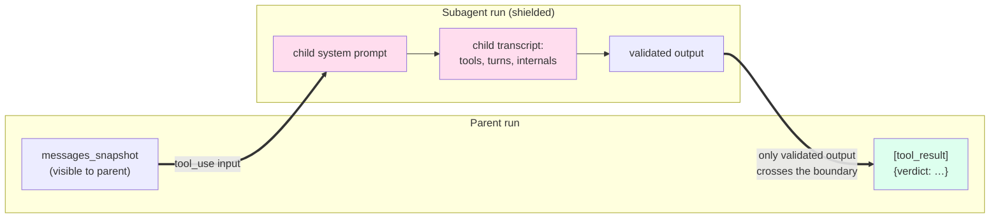

# Vistierie

> **A Java agent framework that lets any application become agentic — with cost-discipline and operational controls baked into the core, not bolted on.**

Vistierie runs LLM-driven worker agents on behalf of consumer applications.
You hand it a tool schema, a system prompt, and (optionally) a cron
expression; Vistierie owns the rest: parallel HTTP tool dispatch,
recursive subagents with context shielding, scheduled execution, a
per-call audit trail with token-accurate EUR-micros cost, a kill switch
per tenant, and tier-based model routing.

[](https://github.com/visterion/vistierie/actions/workflows/docker.yml)
[](LICENSE)
[](https://openjdk.org)
[](https://spring.io/projects/spring-boot)
[](https://postgresql.org)

**Docker image:** [`ghcr.io/visterion/vistierie:main`](https://github.com/visterion/vistierie/pkgs/container/vistierie)

---

## What Vistierie is for

Modern applications increasingly need to do things autonomously: curate
data overnight, react to events, run periodic checks, dispatch worker
LLMs against scoped tasks. Building that yourself means stitching
together an SDK, a scheduler bean, a tool-dispatch loop, an audit
table, a cost rollup, and a way to switch it all off when something
goes wrong.

Vistierie is the service that owns that stitching. Your application
keeps its prompts, tools, and domain logic; Vistierie keeps the runtime.

**What sets it apart from LangChain4j and Spring AI:** cost-discipline
and operational controls are first-class concepts, not add-ons.

- **Tier-based routing** — declare an agent's purpose (`reasoning`,
  `routine`, `bulk`); the resolver picks the concrete model. Switching
  Opus → Haiku is a config change, not a code change.
- **Tenant kill switch** — one PATCH freezes all autonomous activity
  for a tenant. Checked before every dispatch and every cron tick.
- **Per-call audit** — every LLM call writes a row to
  `vistierie.llm_calls` with input/output/cache tokens and EUR-micros
  cost. Failed calls land there too — they're the most important to
  observe.
- **Privacy-locked routing** — rules can pin a sensitive realm (e.g.
  `medical`) to a specific provider regardless of any model override
  in the request body.

---

## Two consumers, two perspectives

Vistierie sees only opaque `tenant`, `realm`, `purpose`, `messages`,
`payload`. The semantics live with the consumer.

### From HiveMem's perspective

HiveMem is a knowledge base that needs to curate itself. It registers
a **Queen** agent that runs hourly via Vistierie's scheduler. The
Queen scans recent cells, decides which ones deserve deeper
investigation, and dispatches **Bee** subagents — one per realm.

```bash
# HiveMem registers the Queen — note the subagent tool referencing a Bee
curl -X POST http://vistierie:8090/agents \
  -H "Authorization: Bearer $HIVEMEM_TOKEN" -d '{
    "name": "queen-curation",
    "system_prompt": "You curate the knowledge base hourly.",
    "model_purpose": "reasoning",
    "schedule": "0 0 * * * *",
    "tools": [
      {"name":"cell.search","webhook_url":"http://hivemem:8080/tools/cell.search",
       "input_schema":{"type":"object"}},
      {"name":"dispatch_bee","type":"subagent","target_agent":"bee-isolation",
       "input_schema":{"type":"object"}}
    ],
    "webhook_token": "<hivemem-side-secret>"
  }'
```

Every hour, Vistierie fires the Queen. The Queen calls back into
HiveMem via tool webhooks (`cell.search`), spawns Bees as subagents,
and HiveMem receives the curation verdict via a completion webhook.
The Queen's transcript never sees the Bee's intermediate reasoning —
only the validated JSON output crosses the boundary (see [Context
shielding](#context-shielding) below).

### From Dracul's perspective

Dracul runs nightly and needs to dispatch **Strigoi** agents that
hunt for findings across its data. Different Strigoi types want
different model tiers — `Strigoi-Spin` reasons hard and gets Sonnet,
`Strigoi-Echo` is a cheap classifier and gets Haiku.

```bash
# Dracul registers a Strigoi — purpose drives tier-based routing
curl -X POST http://vistierie:8090/agents \
  -H "Authorization: Bearer $DRACUL_TOKEN" -d '{
    "name": "strigoi-spin",
    "system_prompt": "You investigate anomalies and report findings.",
    "model_purpose": "reasoning",
    "schedule": "0 0 3 * * *",
    "tools": [
      {"name":"prey.scan","webhook_url":"http://dracul:8081/tools/prey.scan",
       "input_schema":{"type":"object"}}
    ],
    "output_schema": {"type":"object","required":["findings"],
      "properties":{"findings":{"type":"array"}}},
    "webhook_token": "<dracul-side-secret>"
  }'
```

At 03:00 every night, Vistierie wakes the Strigoi, routes it to the
provider+model that the operator wired up for `dracul/reasoning`, and
delivers the validated `findings` array back to Dracul via webhook.
If the operator flips the kill switch on the `dracul` tenant, no
Strigoi fires the next night until the switch is released.

---

## Context shielding

The single non-trivial idea in Vistierie. When a parent agent
dispatches a subagent, the parent never sees the child's system
prompt, intermediate turns, or tool calls. Only the **validated JSON
output** crosses the boundary, packaged as a `tool_result` block.



**Why it matters.** A Queen orchestrating five Bees doesn't pay for
five full Bee transcripts in its own context window. A Bee operating
on `medical` cells doesn't leak raw cell content into a Queen running
with broader scope. Every subagent-eligible agent declares an
`output_schema`; validation happens before the boundary crosses, so
the parent always receives well-typed JSON.

---

## How runs start

Every run shares one execution path; only the trigger differs.

- **Manual** — `POST /agents/{name}/run` returns 202 with a `run_id`.
  Long-poll with `GET /runs/{id}?wait_seconds=30` for the result.
- **Subagent** — a parent agent emits `tool_use` with `type=subagent`.
  Recursion is bounded (default depth 5).
- **Cron** — agents with a `schedule` field fire on the next boundary.
  A 30-second tick is kill-switch-aware and skips if the previous run
  is still open. Idempotency is the consumer's job.

For tasks that tolerate < 1 h latency, `POST /agents/{name}/batch`
routes through Anthropic's Message Batches API at 50 % cost (up to
10 000 items per batch).

---

## Quick start

```bash
docker run --rm -p 8090:8090 \
  -e VISTIERIE_DB_URL=jdbc:postgresql://host.docker.internal:5432/vistierie \
  -e VISTIERIE_DB_USER=vistierie \
  -e VISTIERIE_DB_PASSWORD=vistierie \
  -e VISTIERIE_ADMIN_TOKEN_HASH='<bcrypt-hash>' \
  -e ANTHROPIC_API_KEY='sk-ant-...' \
  -e OPENAI_API_KEY='sk-...' \
  -e XAI_API_KEY='xai-...' \
  ghcr.io/visterion/vistierie:main
```

For local development:

```bash
cd java-server && docker compose -f docker-compose.dev.yml up --build
```

Seeding tenants, generating the admin bcrypt hash, and cost-rollup
queries: [`documentation/operations.md`](documentation/operations.md).

---

## Documentation

| | |
|---|---|
| [agents.md](documentation/agents.md) | Agent definition, tool format, subagent context shielding, scheduling |
| [api.md](documentation/api.md) | REST endpoint reference (`/llm/*`, `/agents/*`, `/runs/*`, `/admin/*`) |
| [architecture.md](documentation/architecture.md) | System overview, data model, request flow |
| [routing.md](documentation/routing.md) | `<tenant, realm, purpose>` → `<provider, model>` resolution |
| [providers.md](documentation/providers.md) | Anthropic plugin, mock mode, adding providers |
| [configuration.md](documentation/configuration.md) | All `vistierie.*` properties and env vars |
| [operations.md](documentation/operations.md) | Tenants, kill switch, cost queries, cron caveats, backups |

---

## Build from source

Requires JDK 25 and Docker (for the Postgres testcontainer used in tests).

```bash
export JAVA_HOME=/path/to/jdk-25
cd java-server
./mvnw test                        # full suite
./mvnw -Pstress test               # opt-in concurrency stress
./mvnw -DskipTests package
java -jar target/vistierie-0.1.0-SNAPSHOT.jar
```

---

## Project values

- **The two-consumer rule.** A feature belongs in Vistierie only if
  both HiveMem and Dracul benefit from it. Single-consumer features
  stay in the consumer.
- **Slim consumers.** Prompts, tool implementations, and domain logic
  live in HiveMem / Dracul. Vistierie sees opaque `tenant`, `realm`,
  `purpose`, `messages`, `payload` — nothing else.
- **Audit before features.** Every LLM call writes a row regardless
  of whether the call succeeded — failed calls are the most
  important to observe.
- **Not an MCP server, not a workflow engine, not a multi-agent bus,
  not a prompt library, not a vector store.** Reasoning lives with
  the consumer; Vistierie owns the runtime.

---

## License

Apache License 2.0 — see [LICENSE](LICENSE) and [NOTICE](NOTICE).
